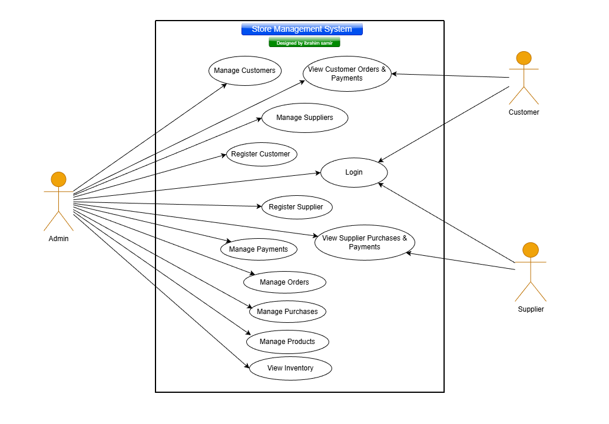
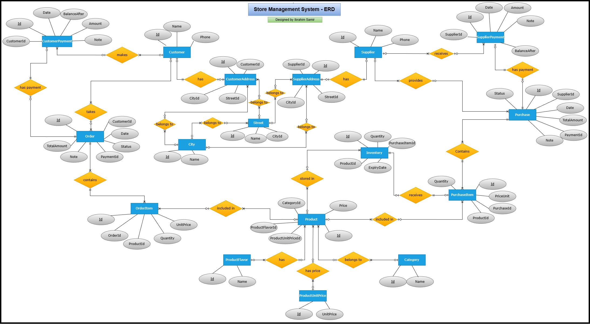
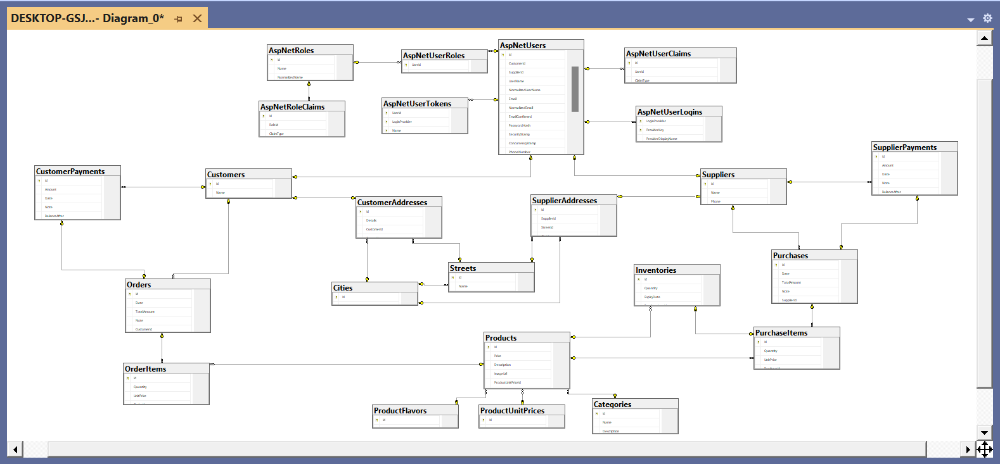
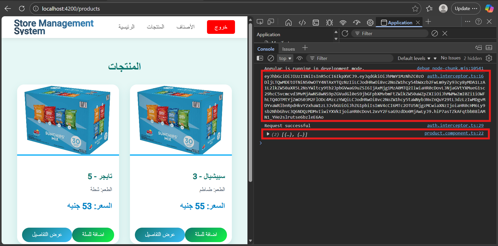

# 🏬 Store Management System - Backend


## 📌 Project Overview

The **Store Management System** is a robust backend solution designed to handle real-world retail operations with a strong focus on clean architecture, scalability, and maintainability.

It manages the complete business workflow, starting from supplier purchases and inventory tracking, through product management with categories, variations, and pricing, and ending with customer orders and payment processing.

The system is built using a layered architecture where responsibilities are clearly separated between controllers, services, and repositories. Business logic is centralized in the service layer, while data access is handled through repositories using Entity Framework Core.

Security is implemented using ASP.NET Identity and JWT-based authentication, ensuring protected API endpoints and role-based authorization. The backend is fully integrated with an Angular frontend to demonstrate real-world usage, secure token handling, and controlled access through CORS policies.

With a normalized database design, generic repository pattern, centralized response handling, and global exception management, the project reflects enterprise-level backend development practices.


---


## 🚀 Key Features

- Clean layered architecture with clear separation between Controllers, Services, and Repositories  
- Business logic handled exclusively in the Service layer  
- Generic Repository for common CRUD operations with virtual methods for extensibility  
- Dependency Injection for DbContext, services, and repositories  
- Centralized result handling using ResultService  
- Global exception handling for consistent error responses  
- Secure Authentication & Role-based Authorization 

---

## 🛠 Technologies & Concepts Used

### 📂 Database & ORM
-  SQL Server  - Entity Framework Core (EF Core)  - LINQ  

### ⚙ Backend & API Development
- ASP.NET Core Web API  - RESTful API Design  - DTOs - Pagination  - Middleware  - Filters - AutoMapper   - Global Exception Handling  - Swagger - Postman

### 🧱 Architecture & Design Patterns
- SOLID Principles  - Repository Pattern  -
  Unit of Work Pattern  - Service Layer  

### 🔐 Security & Authentication
- ASP.NET Identity  - JWT (JSON Web Tokens) -
    Authentication & Authorization  - CORs

### 🧩 Dependency & Infrastructure
- Dependency Injection (DI)  - Logging  

---

## 📊 System Design

###  Use Case Flow


### ERD (Logical Database Design)


### 🗄 Database Implementation Diagram (Implemented Using Code-First Approach)



---


## 📂 Project Structure
- The project follows a clean and organized structure to ensure scalability, maintainability, and clear separation of concerns.

```

StoreManagementSystem/
│
├── AutoMapper/
│   └── Mapping profiles
│
├── Controllers/
│   └── API controllers (REST endpoints)
│
├── Data/
│   ├── Config/
│   │   └── Entity configurations (Fluent API)
│   └── AppDbContext.cs
│
├── DTOs/
│   └── Data Transfer Objects
│
├── Filters/
│   └── Custom filters & exception handling
│
├── Identity/
│   └── Identity setup
│
├── Migrations/
│   └── EF Core migrations
│
├── Models/
│   └── Domain entities
│
├── Repositories/
│   ├── Interfaces/
│   └── Implementations/
│
├── Services/
│   ├── Interfaces/
│   └── Implementations/
|   └── ResultService.cs 
|
├── assets/
│   └── Project diagrams and documentation images
│
├── GlobalUsing.cs
│
├── Program.cs
│
└── appsettings.json
```
### 📘 Domain Models Structure
- The domain layer groups related entities into the same folders to improve organization, readability, and ease of maintenance.
```
Models/
│
├── Customers/
│   ├── Customer.cs
│   ├── CustomerAddress.cs
│   └── CustomerPayment.cs
│
├── Inventories/
│   ├── Inventory.cs
│   ├── Purchase.cs
│   ├── PurchaseItem.cs
│   └── PurchaseStatus.cs
│
├── Locations/
│   ├── City.cs
│   └── Street.cs
│
├── Orders/
│   ├── Order.cs
│   ├── OrderItem.cs
│   └── OrderStatus.cs
│
├── Products/
│   ├── Category.cs
│   ├── Product.cs
│   ├── ProductFlavor.cs
│   └── ProductUnitPrice.cs
│
└── Suppliers/
    ├── Supplier.cs
    ├── SupplierAddress.cs
    └── SupplierPayment.cs
 

```
### 🧠 Design Notes

- The domain layer groups related entities into the same folders
- The same folder structure is consistently applied across:

  - DTOs  
  - EF Core Configurations  
  - Repositories  
  - Services  

This design approach ensures:

✔ Better organization and readability  
✔ Easier maintenance  
✔ High cohesion  
✔ Low coupling  
✔ Scalability for future features  


---
## 🏗 Clean Architecture & Code Quality

The backend is built with a strong focus on clean code principles and maintainable architecture.

 Key design decisions include:

 - Clear separation of layers:
   
     - Controllers for handling HTTP requests
   
     - Services for business logic and validations

     - Repositories for data access

 - Business logic is fully encapsulated within the Service layer, ensuring thin controllers.

 - A Generic Repository is implemented to handle common CRUD operations, with virtual methods that allow overriding behavior in specialized repositories when needed.

 - Full reliance on Dependency Injection (DI) for:

   - AppDbContext

   - Services

   - Repositories

   ensuring loose coupling and easier testing.

 - A centralized ResultService in path : `Services \ ResultService.cs ` is used to standardize API responses and improve communication between services and controllers.

 - Global Exception Handling middleware ensures consistent error handling and prevents application crashes.

---


## ⚡ Performance & Data Consistency


- A Unit of Work pattern is implemented to control:

  - Database context lifecycle

  - SaveChangesAsync() operations

  - Transactions and commits

- The Unit of Work is injected into the Service layer to ensure consistent and controlled database operations and to help prevent race condition issues.

- All database interactions are implemented using asynchronous operations to:

  - Improve performance

  - Avoid blocking requests

  - Ensure better scalability under load

This approach ensures reliable data consistency while maintaining high application responsiveness.

--- 

## 🔗 API Integration & Authentication Flow

The backend API is fully integrated with an Angular frontend to demonstrate real-world usage and secure communication.

✅ Swagger API Testing

    


A Swagger UI screenshot is included to confirm:
- Some endpoints
- API responses are returned as expected


## 🌐 CORS Policy Configuration

To enhance security, the backend CORS policy allows requests only from:
```
http://localhost:4200
```
ensuring controlled access from the Angular frontend.

- And Can you change accessability to endpoints from Program.cs

```
  builder.Services.AddCors(options =>
  {
      options.AddPolicy("Users", policy =>
      {
          policy.WithOrigins("http://localhost:4200") 
                .AllowAnyMethod()
                .AllowAnyHeader();
      });
  });
```


## 🔐 JWT Authentication with Angular

The Angular application includes:

- A login component for user authentication
- An authentication service responsible for handling login requests and token storage
- Secure client-side storage of the JWT token
- An HTTP interceptor that automatically attaches the token to request headers for authorized API calls

The screenshot below demonstrates the complete end-to-end data flow:



A frontend snapshot showing:
- A successful login process
- The JWT token printed in the browser console (for testing purposes only)
- API responses received in the ProductService
- Products displayed in the ProductComponent
  
This confirms:
✔ Secure authentication flow
✔ Proper token handling
✔ Authorized access to protected endpoints 
✔ Successful frontend-backend integration


---

## ▶ How to Run the Project

1. Clone the repository
2. Configure connection string in appsettings.json
3. Run database migrations:
4. Run the project using Visual Studio

## ⚙ Configuration

- SQL Server connection string
- JWT settings (Secret Key, Issuer, Audience)
- Logging configuration


---

## 👨‍💻 Author

**Ibrahim Samir**  
Software Engnieer (.Net) - Back-End Developer

